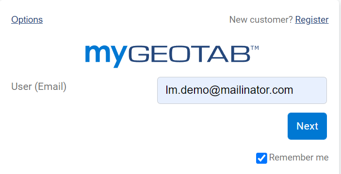
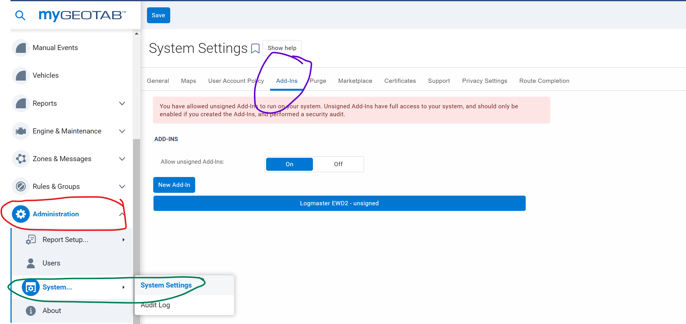
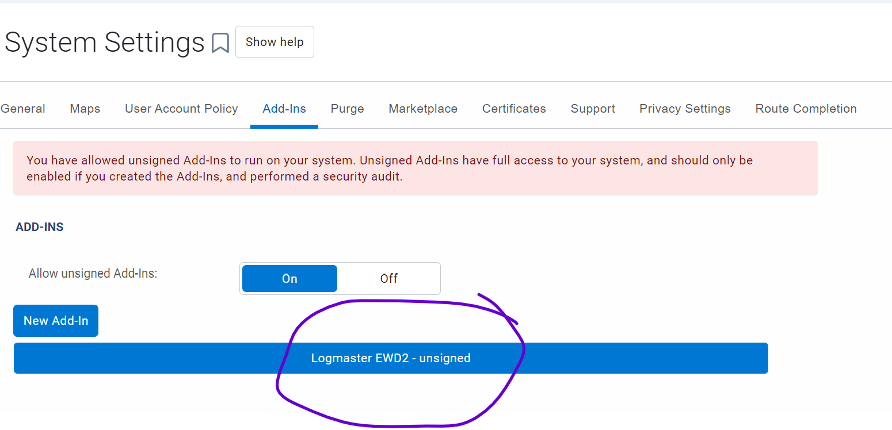
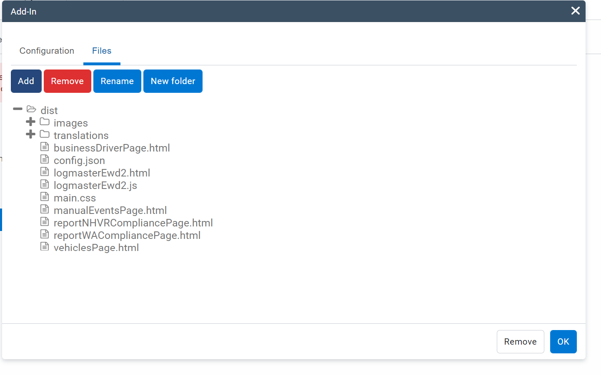

# logmaster-geotab-integration

## Project setup
```
npm install
```

### Compiles and hot-reloads for development
```
npm run serve
```
### LOGIN credentials:
```
Admin

    lm.demo@mailinator.com

    Password1!

Driver

    lm.driver@mailinator.com

    Password1!


Server

    https://my1623.geotab.com/

Database

    Logmaster
```

### Compiles and minifies for production
```
npm run build
```


### Deploying to Geotab

Login to https://my1623.geotab.com/ using one of the Admin credentials above.



On the side menu, navigate to Administration -> System -> System Settings, then open the 'Add-Ins' Tab



Click on the existing Add-in to update



On the 'Configuration' Tab, Copy the contents from 'dist/config.json' file into the 'Add-In configuration file' textarea


On the 'Files' Tab, click on 'Add' button, then upload all the 'dist' folder



Click 'Ok' button, then click on 'Save' on the upper left corner


If all went well, you should be able to see the changes on geotab based on the 'dist/config.json'


### Customize configuration
See [Configuration Reference](https://github.com/Geotab/generator-addin).
