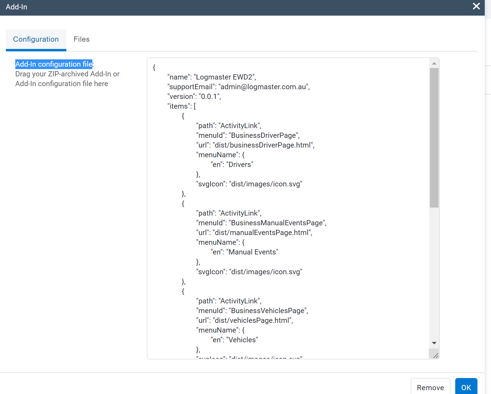

# logmaster-geotab-integration

## Project setup
```
npm install
```

### Compiles and hot-reloads for development
```
npm run serve
```
### credentials:
```
Use your geotab credentials to access the geotab portal.
```
### Deploying to Geotab STEP 1: Compiles and minifies for sandbox
```
npm run build:sandbox
```

### Deploying to Geotab STEP 1: Compiles and minifies for staging
```
npm run build:staging
```

### Deploying to Geotab STEP 1: Compiles and minifies for production
```
npm run build:production
```


### Deploying to Geotab STEP 2 and beyond

Login to geotab's live portal using your credentials above.


On the side menu, navigate to Administration -> System -> System Settings, then open the 'Add-Ins' Tab


Click on the existing Add-in to update


On the 'Configuration' Tab, Copy the contents from 'dist/config.json' file into the 'Add-In configuration file' textarea




Click 'Ok' button, then click on 'Save' on the upper left corner


If all went well, you should be able to see the changes on geotab based on the 'dist/config.json'

Similar to this:


### Customize configuration
See [Configuration Reference](https://github.com/Geotab/generator-addin).


### Deploying to Firebase Hosting
1. Build project using `npm run build:production`
2. Copy files from `dist` folder to `public` folder. (create a public folder, if its folder is not created yet.)
3. Login to firebase using `firebase login`
4. Deploy using `firebase deploy`

### Disabling Firebase Hosting
1. Run `firebase hosting:disable`
2. Navigate to firebase portal and delete deployment.
